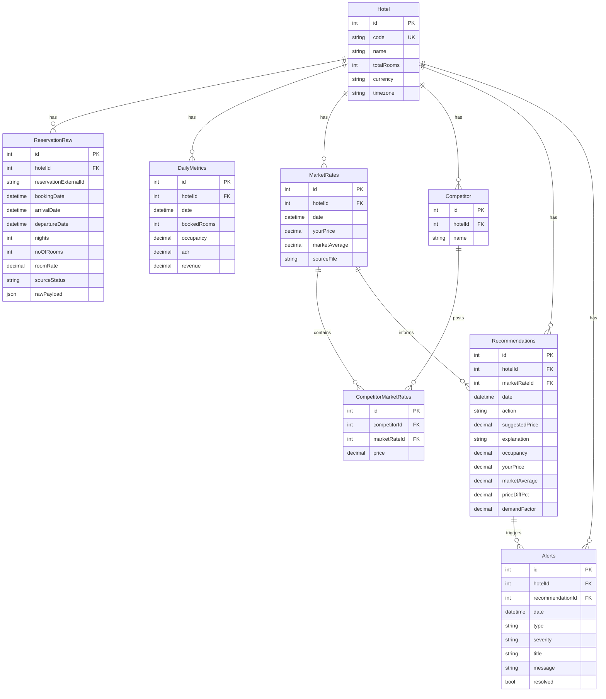

# RMS MVP Backend (NestJS + Prisma + PostgreSQL)

Production-oriented MVP backend for hotel Revenue Management decision support.

## 1. What This Includes

- XML reservation ingestion (`POST /upload/xml`)
- Expedia Excel price-grid ingestion (`POST /upload/excel`)
- Daily metrics calculation (occupancy, ADR, revenue)
- Market and competitor rate persistence
- Rule-based pricing recommendations
- Alert generation from recommendation outcomes
- Report generation for RM analysis (`/reports/*`)

Stack:

- NestJS (TypeScript)
- PostgreSQL (Supabase-compatible)
- Prisma ORM

## 2. Project Structure

```txt
src/
  app.module.ts
  main.ts
  common/
  prisma/
  ingestion/
  metrics/
  market/
  recommendation/
  alerts/
  reports/
prisma/
  schema.prisma
  migrations/
  seed.ts
```

## 3. Setup (Step by Step)

1. Install dependencies:

```bash
npm install
```

2. Configure environment:

```bash
cp .env.example .env
# Then edit DATABASE_URL for your Supabase/PostgreSQL instance
```

3. Generate Prisma client:

```bash
npm run prisma:generate
```

4. Apply migration:

```bash
npm run prisma:migrate
```

5. Seed sample data:

```bash
npm run prisma:seed
```

6. Start API:

```bash
npm run start:dev
```

## 4. Core Business Logic

### XML Reservations

Extracts per reservation:

- `booking_date` from `INSERT_DATE`
- `arrival_date` from `ARRIVAL`
- `room_rate` from `SHARE_AMOUNT_PER_STAY` or `SHARE_AMOUNT`

Stores raw reservation records in `ReservationRaw` and then recomputes `DailyMetrics` for the arrival-date range found in the upload.

### XML History and Forecast (Opera Cloud)

`POST /upload/xml` also supports Opera `History and Forecast` XML reports:

- Detects `A_STAT` (History) and `B_FORE` (Forecast) sections
- Parses daily `CONSIDERED_DATE`, `CF_CALC_OCC_ROOMS`, `CF_OCCUPANCY`, `CF_AVERAGE_ROOM_RATE`, and `REVENUE`
- Writes directly to `DailyMetrics` for the reported date horizon

### XML CRS Room Rate Distribution

`POST /upload/xml` also supports CRS `RoomRateDistribution` XML exports:

- Reads report criteria (`StartDate`, `EndDate`, `WhichDate`, `ShowGroups`, `Currency`)
- Extracts grand totals (`Reservation_Count`, `Room_Nights`, `Revenue`, `ADR`)
- Stores a snapshot for reconciliation against RMS totals
- Re-uploading the same criteria window updates the snapshot and returns deltas

### Expedia Excel Market Grid

Expected format from your provided file:

- Row 9: month headers (e.g., `APRIL 2026`)
- Row 11: day of month
- Row 12+: hotel rows with daily prices

Parser rules:

- First hotel row is always your hotel (`your_price`) as requested
- Row labeled `Competitive set average rates` is market average when present
- Remaining hotel rows become competitors
- Daily competitor rates are stored in `CompetitorMarketRates`

### Recommendation Rules

Thresholds:

- High occupancy: `> 70%`
- Low occupancy: `< 30%`
- Significant price difference: `> 10%` versus market average

Actions:

- High demand + underpriced => `increase`
- Low demand + overpriced => `decrease`
- Otherwise => `hold`

Suggested price combines:

- Historical demand factor (from occupancy)
- Market positioning factor (price gap vs market average)

## 5. API Endpoints

### `POST /upload/xml`

Multipart form-data:

- `file`: XML file
- Optional query: `hotelId`

### `POST /upload/excel`

Multipart form-data:

- `file`: Excel file (`.xlsx`/`.xls`)
- Optional query: `hotelId`

### `GET /metrics`

Query params:

- `hotelId` (optional)
- `startDate` (optional, ISO date)
- `endDate` (optional, ISO date)

### `GET /recommendations`

Query params:

- `hotelId` (optional)
- `startDate` (optional, ISO date)
- `endDate` (optional, ISO date)

Response items include required format:

- `date`
- `action` (`increase`, `decrease`, `hold`)
- `suggested_price`
- `explanation`

### `GET /alerts`

Query params:

- `hotelId` (optional)
- `startDate` (optional)
- `endDate` (optional)
- `resolved` (optional: `true|false`)

### `GET /reports/pickup`

Booking pickup by booking-date and stay-date windows.

Query params:

- `hotelId` (optional)
- `bookingStartDate` (optional, ISO date)
- `bookingEndDate` (optional, ISO date)
- `stayStartDate` (optional, ISO date)
- `stayEndDate` (optional, ISO date)

### `GET /reports/forecast-variance`

Compares baseline metrics (`DailyMetrics`) against current OTB from reservations.

Query params:

- `hotelId` (optional)
- `startDate` (optional, ISO date)
- `endDate` (optional, ISO date)

### `GET /reports/market-position`

Shows price gap vs market and competitor ranking by day.

Query params:

- `hotelId` (optional)
- `startDate` (optional, ISO date)
- `endDate` (optional, ISO date)

### `GET /reports/recommendation-compliance`

Evaluates alignment between current price and suggested recommendation.

Query params:

- `hotelId` (optional)
- `startDate` (optional, ISO date)
- `endDate` (optional, ISO date)
- `tolerancePct` (optional, default `2`)

### `GET /reports/revenue-opportunity`

Estimates upside and overpricing risk from recommendation deltas.

Query params:

- `hotelId` (optional)
- `startDate` (optional, ISO date)
- `endDate` (optional, ISO date)

### `GET /reports/executive-summary`

Consolidated KPI + risk + opportunity summary for business review.

Query params:

- `hotelId` (optional)
- `startDate` (optional, ISO date)
- `endDate` (optional, ISO date)

### `GET /reports/crs-reconciliation`

Compares RMS totals against the latest matching CRS `RoomRateDistribution` snapshot.

Query params:

- `hotelId` (optional)
- `startDate` (optional, ISO date)
- `endDate` (optional, ISO date)
- `whichDate` (optional, e.g., `Confirmation`)

## 6. Example Requests

```bash
curl -X POST http://localhost:3000/upload/xml \
  -F "file=@C:/path/resenteredon_8444322.XML"

curl -X POST http://localhost:3000/upload/excel \
  -F "file=@C:/path/expedia_price_grid_69725697_2026_04_07.xlsx"

curl "http://localhost:3000/metrics?startDate=2026-04-01&endDate=2026-04-15"

curl "http://localhost:3000/recommendations?startDate=2026-04-08&endDate=2026-04-21"

curl "http://localhost:3000/alerts?resolved=false"

curl "http://localhost:3000/reports/pickup?bookingStartDate=2026-04-01&bookingEndDate=2026-04-09&stayStartDate=2026-04-09&stayEndDate=2026-06-30"

curl "http://localhost:3000/reports/forecast-variance?startDate=2026-04-09&endDate=2026-06-30"

curl "http://localhost:3000/reports/market-position?startDate=2026-04-09&endDate=2026-06-30"

curl "http://localhost:3000/reports/recommendation-compliance?startDate=2026-04-09&endDate=2026-05-15&tolerancePct=2"

curl "http://localhost:3000/reports/revenue-opportunity?startDate=2026-04-09&endDate=2026-05-15"

curl "http://localhost:3000/reports/executive-summary?startDate=2026-04-09&endDate=2026-05-15"

curl -X POST "http://localhost:3000/upload/xml?hotelId=1" \
  -F "file=@C:/path/RoomRateDistribution.xml"

curl "http://localhost:3000/reports/crs-reconciliation?hotelId=1&startDate=2026-03-01&endDate=2026-03-31&whichDate=Confirmation"
```

## 7. ERD (Mermaid)



## 8. Scaling Notes

- Keep ingestion idempotent using unique keys and upserts
- Batch large inserts where possible
- Move recommendation generation to scheduled jobs for production
- Add auth and tenant scoping before multi-property rollout
